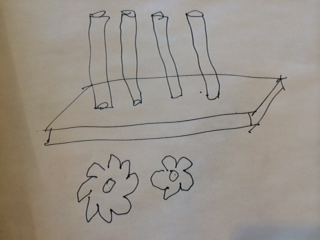

Imagine a set of five spindles arranged on a board. Associated with each spindle is a set of four gears, making a total of 50. There is one and only one arrangement of gears that will create a functional machine - one all the gears mesh so that turning one gear will turn the others.

If it takes someone 1 hour to put a gear onto a spindle, how long will it take, as a range
